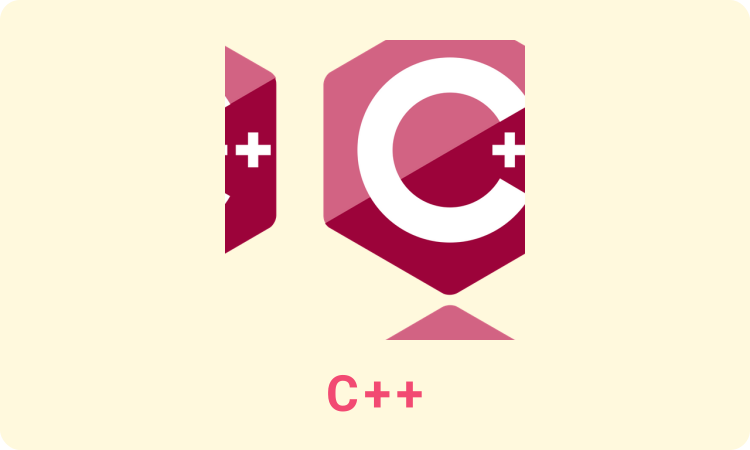
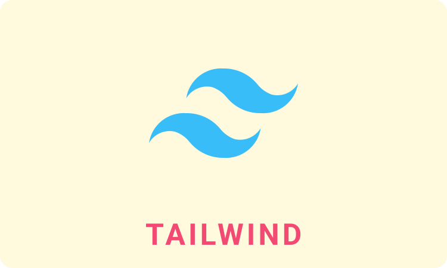

<h1 align="center">
	
	Hi, I am Mahim Chowdhury! Great to see you here!
	
</h1>

<!-- Typing Intro Section -->

	

<!-- Social icons section -->

	
	&#8287;&#8287;&#8287;&#8287;&#8287;
	
	&#8287;&#8287;&#8287;&#8287;&#8287;
	
	&#8287;&#8287;&#8287;&#8287;&#8287;
	

<!-- About Me Section -->
## About Me 👉😇👈
I am Tanmay Mitra, currently pursuing my B.Eng degree in CSE (AIML Specialized) from [Chandigarh University](https://www.cuchd.in/). I have a passion for learning new things. I am a full-stack web developer with 5+ years of coding experience. I am always open to collaborating on projects and innovative/disruptive ideas. 

💻 I love to participate in coding competition.

👯 I’m looking to collaborate on Open-Source Projects

📖 I’m currently working on few projects and learning DSA to improve my competitive programming skill.

🤔 **I’m Open to Work on Domain like Web Developer, Software Development and DevOps**

<!-- Skills Section -->
## 🧠 Skills
<h3>
	
	Languages
</h3>
<table width="100%">
	<tr>
		<td align='center'>
			
		</td>
		<td align='center'>
			
		</td>
		<td align='center'>
			
		</td>
		<td align='center'>
			
		</td>
	</tr>
	<tr>
		<td align='center'>
			
		</td>
		<td align='center'>
			
		</td>
		<td align='center'>
			
		</td>
	</tr>
</table>

<h3>
	
	Libraries And Frameworks
</h3>
<table width="100%">
	<tr>
		<td align='center'>
			
		</td>
		<td align='center'>
			
		</td>
		<td align='center'>
			
		</td>
		<td align='center'>
			
		</td>
	</tr>
	<tr>
		<td align='center'>
			
		</td>
	</tr>
</table>

<h3>
	
	Database And Others
</h3>
<table width="100%">
	<tr>
		<td align='center'>
			
		</td>
		<td align='center'>
			
		</td>
		<td align='center'>
			
		</td>
		<td align='center'>
			
		</td>
	</tr>
	<tr>
		<td align='center'>
			
		</td>
		<td align='center'>
			
		</td>
		<td align='center'>
			
		</td>
		<td align='center'>
			
		</td>
	</tr>
</table>

## 🔥 Streak stats

	

## 💻 GitHub Profile Stats

	
	

	

