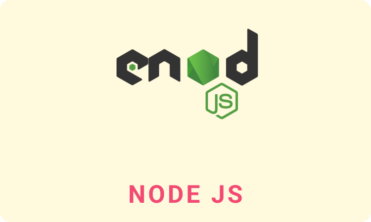
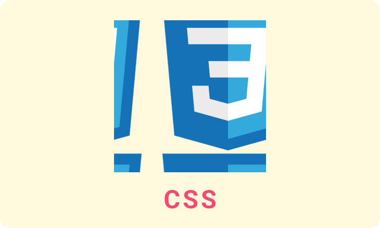
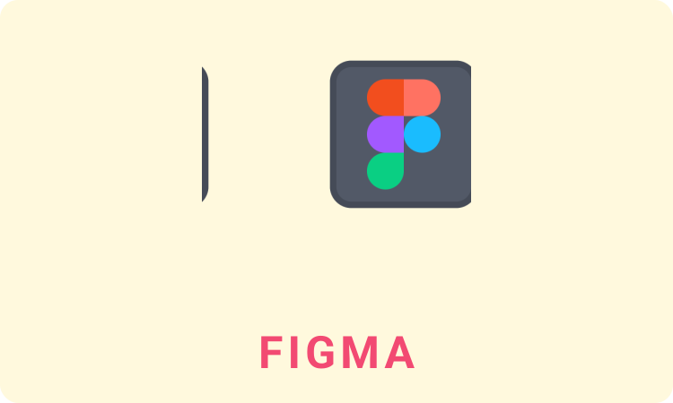

<h1 align="center">
	
	Hi, I am Mahim Chowdhury! Great to see you here!
	
</h1>

<!-- Typing Intro Section -->

	

<!-- Social icons section -->

	
	&#8287;&#8287;&#8287;&#8287;&#8287;
	
	&#8287;&#8287;&#8287;&#8287;&#8287;
	
	&#8287;&#8287;&#8287;&#8287;&#8287;
	

<!-- About Me Section -->
## About Me 👉😇👈
I am a Front End Web Developer with a background in Business Administration and a DataCamp Certified Associate Data Analyst. My technical skills include proficiency in HTML, CSS, JavaScript, ReactJS,  with expertise in using Next.js for building complex front-end applications. My soft skills include communication, problem-solving, time management and adaptability or creativity as preference.

An example of my strength is my ability to manage my own workload while working remotely for Fearless Social Media Agency, a USA-based digital marketing agency, using Next.js to create dynamic and responsive interfaces. I also have experience as a Web Developer at DhakaCast, a national award-winning healthcare startup, where I built an interactive web platform for medical professionals.

In the future, I am committed to continuing to develop my skills and take on new challenges in the web development and data analysis fields.

<!-- Skills Section -->
## 🧠 Skills
<h3>
	
	Languages
</h3>
<table width="100%">
	<tr>
		<td align='center'>
			
		</td>
		<td align='center'>
			
		</td>
	</tr>
	<tr>
		<td align='center'>
			
		</td>
		<td align='center'>
			
		</td>
		<td align='center'>
			
		</td>
	</tr>
</table>

<h3>
	
	Libraries And Frameworks
</h3>
<table width="100%">
	<tr>
		<td align='center'>
			
		</td>
		<td align='center'>
			
		</td>
		<td align='center'>
			
		</td>

	</tr>
</table>

<h3>
	
	Database And Others
</h3>
<table width="100%">
	<tr>
		<td align='center'>
			
		</td>
		<td align='center'>
			
		</td>
		<td align='center'>
			
		</td>
	</tr>
	<tr>
		<td align='center'>
			
		</td>
		<td align='center'>
			
		</td>
		<td align='center'>
			
		</td>
		<td align='center'>
			
		</td>
	</tr>
</table>

## 🔥 Streak stats

	

## 💻 GitHub Profile Stats

	
	

